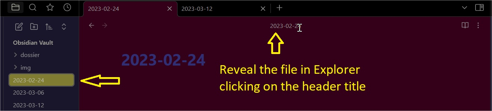

# Reveal File in Explorer  
  
This plugin allows you to reveal the active file in the explorer by clicking on the header title (when explorer panel opened). It works on several windows.

Settings:  

- Option to fold all folders except the one containing the active file
- More options to reveal when opening files

