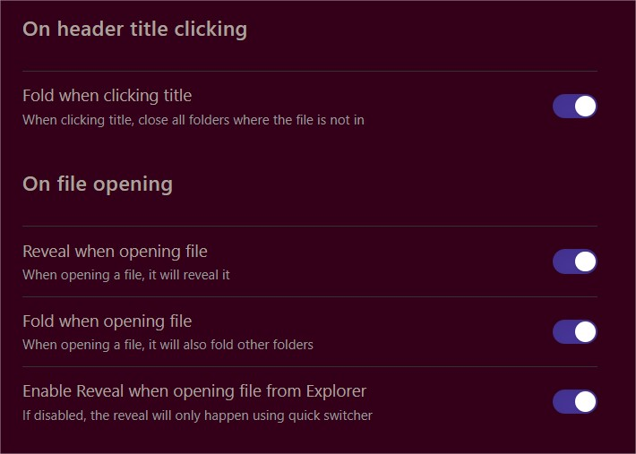

# Reveal File in Explorer  
  
Reveal active file in the explorer:  

* clicking on the header title  
* opening files

Fold other folders not containing the active file

Settings:

N.B: If you desactivate "Reveal when opening file", other settings below, linked to it, will be hidden

edit: added an option to exclude some folders from being revealed on opening
